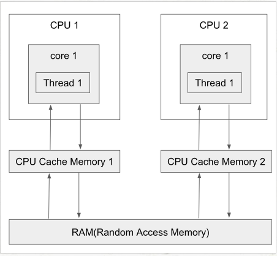

# 동시성 프로그래밍에서 발생할 수 있는 문제점
컴퓨터의 CPU와 RAM의 관계도를 그려보면 다음과 같다.

CPU가 어떤 작업을 처리하기 위해 데이터가 필요할 때, CPU는 RAM의 일부분을 고속 저장 장치인 CPU Cache Memory로 읽어 드린다. 이 읽어드린 데이터로 명령을 수행하고 이 데이터를 다시 RAM에 저장하기 위해서는 데이터를 읽어들일 때의 과정을 역순으로 밟는다. 즉, 적절한 시점에 CPU Cache Memory에서 RAM으로 쓰기 작업을 하게 된다. 그러나 CPU가 캐시에 쓰기 작업을 수행했다고 해서 바로 RAM으로 쓰기 작업을 수행하지 않는다. 반대의 과정인 읽기도 마찬가지다.

동시성 프로그래밍에서는 CPU와 RAM의 중간에 위치하는 CPU Cach Memory와 병렬성이라는 특징 때문에 다수의 쓰레드가 공유 자원에 접글할 때 두 가지 문제가 발생할 수 있다.

- 가시성 문제
- 원자성(동시 접근)문제

## 가시성 문제
가기성 문제는 여러 개의 스레드가 사용됨에 따라, CPU Cach Memory와 RAM의 데이터가 서로 일치하지 않아 생기는 문제를 의미한다.

이를 해결하기 위해서는 가시성이 보장되어야 하는 변수들을 CPU Cache Memory에서 불러오는 것이 아닌 RAM에서 바로 읽도록 보장해야 한다.

** 변수에 volatile 키워드를 붙여줘서 가시성을 보장할 수 있다. **

private static volatile boolean isStop;

** 그러나 가시성이 보장된다고 동시성이 보장되는 것이 아니다. **
volatile 만으로 동시성이 보장되는 경우는 '하나의 스레드만이 연산을 해야한다'라는 전제가 깔려있다.
이 전제가 확실한 경우 lock없이 volatile만으로도 문제 없는 데이터를 사용할 수 있다.

## 원자성 문제
원자성은 가시성과 멀티스레드 환경에서 스레드간 공유 메모리 이슈를 발생시킨다는 점에 공통점을 가지고 있지만 시스템 관점에서 보면 두 개념은 다른 곳에 존재한다.

- 가시성
    - CPU - Cache - Memory 관계 상의 개념
- 원자성
    - 한줄의 프로그램 문장이 컴파일러에 의해 기계어로 변경되면서, 이를 기계가 순차적으로 처리하기 위한 여러 개의 Machine Instruction이 만들어져 실행되기 때문에 일어나는 현상을 설명하는 용어

만약 i++ 연산을 2개의 스레드가 동시에 100회 실행한다고 가정한다면 i++연산이 원자성을 가지고 있는 연산이라고 하면 결과가 200이여야 하겠지만, 실제로 프로그램을 수행하면 200보다 작은 값이 출력된다. 원인은 i++가 3개의 instruction으로 이루어져 있기 때문에 스레드 A가 i값을 읽어 i+1 연산을 해서 메모리에 반영하기 직전에 스레드 B가 i+1 연산을 수행하고 메모리에 반영을 한다면 후자의 연산은 무효가 되기 때문이다. 이러한 원자성 문제를 해결하기 위해서는 synchronized또는 atomic을 사용해야 한다.

** 참고로 원자성 문제를 synchronized 또는 atomic을 통해 해결한다면 가시성의 문제도 해결된다.** synchronized 블럭을 들어가기 전에 CPU Cache Memory와 Main Momory를 동기화 해주며, atomic의 경우에는 CAS 알고리즘에 의해 원자성 문제와 CPU Cache Memory에 잘못된 값을 참조하는 문제를 동시에 해결해 주기 때문이다.
